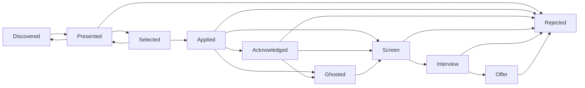
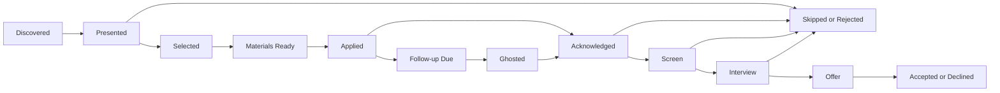

# Application Lifecycle Design Review

Owner lane: Product & Operations
Status: Planning review for Ash and Anna
Runtime impact: None
Scope: Application states, transitions, tracked data, reporting, reminders, and future automation opportunities

## 1. Application Lifecycle Diagram

Current platform lifecycle:

Recommended product lifecycle, including future review concepts that may require Ash approval before implementation:

Product interpretation:

- Current states are adequate for the MVP workflow.
- `materials_ready`, `followup_due`, and `accepted` are useful future concepts, but they should not be implemented as states without Ash review.
- `followup_due` may remain a queue event rather than an application state.
- `materials_ready` may be better represented by generated document records rather than a job state.
- `accepted` may be needed eventually because using `offer -> rejected` to represent a declined offer is operationally awkward.

## 2. State Definitions

### Current Required Statuses

These statuses exist today and should remain valid lifecycle concepts.

| Status | Meaning | Primary owner | Product purpose |
| --- | --- | --- | --- |
| `discovered` | Job was ingested, deduplicated, scored, and stored but has not been shown for decision. | System | Candidate inventory. |
| `presented` | Job met reporting threshold and was surfaced for human review. | System then James | Daily apply/skip decision. |
| `selected` | James chose the job for application material generation or application preparation. | James | Commit document-generation effort. |
| `applied` | James submitted the application externally. | James | Start response and follow-up clock. |
| `acknowledged` | Employer or ATS confirmed receipt or sent meaningful response. | James/system assist | Distinguish silence from response. |
| `screen` | Recruiter screen, phone screen, assessment, or first formal screening step exists. | James | Track response quality. |
| `interview` | Formal interview stage exists. | James | Track serious pipeline progress. |
| `offer` | Employer extended an offer or conditional offer. | James | Track successful outcome. |
| `rejected` | Job is closed from James's perspective because James passed, employer rejected, or offer was declined. | James/system assist | Terminal closure. |
| `ghosted` | Application went stale without meaningful response after follow-up window. | System suggests; James reviews | Terminal or near-terminal silence outcome. |

### Recommended Future Status Concepts

These are planning recommendations, not implementation instructions.

| Concept | Recommended representation | Rationale |
| --- | --- | --- |
| `materials_ready` | Prefer derived status from generated resume and cover-letter records. | Avoid duplicating document state in `app_state`. |
| `followup_due` | Prefer follow-up queue event. | A job can remain applied, acknowledged, or ghosted while a reminder is due. |
| `withdrawn` | Possible future terminal state. | Useful when James voluntarily exits after applying, separate from employer rejection. |
| `closed` | Possible future source/job status, not application status. | Job posting closure is not the same as James's application outcome. |
| `accepted` | Possible future terminal state after `offer`. | Needed if the tool eventually tracks final outcomes rather than just offer generation. |
| `declined` | Possible future terminal state after `offer`. | Cleaner than routing declined offers through `rejected`. |

Product recommendation: keep the current enum stable for now, but ask Ash whether `accepted`, `declined`, and `withdrawn` belong in a future lifecycle expansion.

## 3. Information To Track At Each Stage

### Discovered

Track:

- canonical job ID
- source and source job ID
- company and firm ID when known
- title
- apply URL
- location and remote flag
- posted date, first seen, last seen
- raw and normalized job description
- discipline tags
- salary range when available
- ATS type
- content hash for repost detection
- match score, stretch category, benefit score, trajectory score
- knockout flags
- LLM grade and rationale when available

Operator need:

- No direct action yet unless debugging source quality or reviewing backlog.

### Presented

Track:

- all discovered fields
- presentation date and report reference
- why it was presented: score, grade, reasons, threshold
- daily report line content
- Sheet row status and notes

User actions:

- Select/apply intent.
- Skip/reject.
- Leave for later review.
- Open apply URL.
- Add notes.

### Selected

Track:

- selection timestamp
- selection source: Sheet, CLI, future dashboard
- selected by James
- generated document status
- latest resume link
- latest cover-letter link
- keyword coverage and missed keywords
- generation model used
- generation errors if any

User actions:

- Review generated materials.
- Regenerate materials if needed.
- Apply externally.
- Return to presented if not ready.
- Reject if the job no longer looks worthwhile.

### Applied

Track:

- applied date
- application channel: ATS, email, recruiter, referral, other
- submitted resume link
- submitted cover-letter link
- submitted application URL or confirmation page if available
- confirmation number or email message ID when available
- next action date
- follow-up due date
- application notes

User actions:

- Mark applied after external submission.
- Add confirmation details.
- Record referral or contact if applicable.
- Resolve or defer follow-up reminders.

### Acknowledged

Track:

- acknowledgment date
- source: email, ATS portal, recruiter, phone, other
- message/contact reference
- next expected action
- due date for next follow-up if no movement

User actions:

- Mark as acknowledged.
- Record contact and next step.
- Move to screen if a screening step is scheduled.
- Mark rejected or ghosted if later appropriate.

### Screen

Track:

- screen date and time
- contact name and role
- contact email or source
- screen type: recruiter, technical, assessment, HR, automated
- prep notes
- outcome
- next action date

User actions:

- Schedule or record screen.
- Add prep notes.
- Move to interview.
- Mark rejected.

### Interview

Track:

- interview date and time
- interview type: technical, behavioral, panel, final, onsite, virtual
- interviewer names when known
- prep notes
- thank-you sent status
- next action date
- outcome

User actions:

- Record interview details.
- Trigger thank-you reminder.
- Move to offer or rejected.

### Offer

Track:

- offer date
- role title and location
- salary and benefits summary
- deadline
- negotiation notes
- decision status
- final outcome: accepted, declined, expired, withdrawn, pending

User actions:

- Record offer.
- Track negotiation and decision deadline.
- Close lifecycle after final decision.

### Rejected

Track:

- rejection date
- rejection source: employer, James, auto-cleanup, offer declined
- reason category if known
- note
- whether follow-ups are resolved

User actions:

- Close open reminders.
- Add useful lesson if applicable.
- Keep record for funnel analytics.

### Ghosted

Track:

- ghosted date
- last meaningful contact date
- follow-up attempts
- decision: follow up again, close, or reopen after response

User actions:

- Decide whether to send another follow-up.
- Resolve reminder.
- Reopen to screen if a late response arrives.

## 4. Transition Rules

### Current Transition Rules

Current valid transitions are:

| From | Allowed transitions |
| --- | --- |
| `discovered` | `presented` |
| `presented` | `selected`, `discovered`, `rejected` |
| `selected` | `applied`, `presented` |
| `applied` | `acknowledged`, `screen`, `rejected`, `ghosted` |
| `acknowledged` | `screen`, `rejected`, `ghosted` |
| `screen` | `interview`, `rejected` |
| `interview` | `offer`, `rejected` |
| `offer` | `rejected` |
| `rejected` | none |
| `ghosted` | `screen` |

### Product Review Of Current Rules

Current rules support the basic workflow, but several product issues should be tracked:

- `presented -> discovered` works as an undo or defer action, but the label is not operator-friendly.
- `selected -> applied` assumes generated materials are ready, but the state machine does not enforce document readiness.
- `applied -> screen` is useful because some employers skip explicit acknowledgment.
- `ghosted -> screen` is useful for late responses.
- `offer -> rejected` conflates employer rejection, James declining an offer, and offer expiration.
- There is no explicit terminal success state after offer.

### Recommended Product Transition Principles

- Every state transition should write an event with timestamp, source, and note.
- User-owned transitions should be explicit, especially `selected`, `applied`, `rejected`, and offer outcomes.
- System-owned transitions should be conservative and reversible where practical.
- Document generation should not mark a job as applied.
- Applying remains a human action outside the tool.
- Reminder events should not silently change application outcome except for reviewable ghosting.
- Terminal states should resolve open reminders unless James chooses to preserve them.

## 5. Reporting Requirements

### Daily Report Events

Daily reports should remain compact, actionable, and explainable.

Events that should appear in daily reports:

- Newly presented jobs above threshold.
- Selected jobs missing generated documents.
- Generated documents ready for selected jobs.
- Applied jobs with follow-up due today or overdue.
- Applications auto-flagged as ghosted.
- Acknowledged applications with no next action date.
- Screens or interviews due soon if date tracking exists.
- Offers or decision deadlines if offer tracking exists.
- Source or firm issues that affect today's job review.

Events that should not dominate daily reports:

- Every discovered job below threshold.
- Full state history.
- Full generated document history.
- Raw LLM rationale unless needed for a presented job.
- Dashboard-level funnel analytics.

### Daily Report Sections

Recommended report structure:

1. New jobs for review.
2. Selected jobs needing materials or submission.
3. Follow-ups due.
4. Upcoming screens/interviews/offers.
5. Exceptions and source health warnings.

### Funnel Reporting Requirements

Lifecycle metrics should support operational learning:

- jobs discovered by source
- jobs presented by source
- selected rate by source
- applied count
- response rate after applied
- screen rate after applied
- interview rate after applied
- offer count
- ghosted count
- median days from applied to response
- median days from applied to terminal state
- outcomes by stretch category
- outcomes by benefit band and trajectory band after Phase 2
- outcomes by firm after Phase 3

## 6. Reminder Requirements

### Reminder Triggers

Required reminders:

- Follow up 10 business days after `applied` if no acknowledgment or screen exists.
- Review ghosted applications after 30 calendar days with no progress.
- Resolve follow-up when job moves to acknowledged, screen, interview, offer, rejected, or a user-marked terminal outcome.

Recommended future reminders:

- Review selected jobs that have generated docs but are not marked applied after 2 days.
- Review selected jobs with missing docs after generation failure.
- Send thank-you note reminder after interview.
- Check status after screen if no next step after 7 days.
- Check status after interview if no next step after 7 days.
- Offer decision deadline reminder 3 days before deadline and day of deadline.
- Recheck stale apply URLs for selected jobs not yet applied.
- Remind to add notes when a job enters screen, interview, or offer without context.

### Reminder Data Needed

Each reminder should have:

- canonical job ID
- action type
- due date
- resolved flag
- resolved timestamp
- note
- trigger source
- recommended action label
- optional snooze date in future design

### Reminder Product Rules

- Reminders should be actionable, not just informational.
- Reminders should avoid duplicate nagging for the same unresolved action.
- Reminders should be resolvable without changing application state when appropriate.
- Reminders should show enough context to act: company, title, current state, apply URL, and last transition.
- Automation may propose ghosting, but James should be able to reopen a lifecycle if a late response arrives.

## 7. Future Automation Opportunities

Allowed or promising automation opportunities:

- Detect selected jobs with missing documents.
- Detect generated documents ready for submission.
- Suggest follow-up due dates based on application state.
- Auto-create follow-up queue items after applied.
- Auto-flag stale applied jobs as ghosted for review.
- Parse email confirmations into `acknowledged` candidates for human confirmation.
- Detect interview or screen scheduling emails and suggest state changes.
- Detect rejection emails and suggest `rejected` state.
- Detect duplicate/reposted jobs and surface them as follow-up or reapply signals.
- Summarize weekly funnel health and source quality.
- Recommend source or firm targeting adjustments after enough outcomes exist.
- Draft follow-up email text for human review.
- Draft interview prep checklist from job description and profile evidence.

Automation boundaries:

- Do not submit applications.
- Do not send follow-up emails without human approval.
- Do not mark offer outcomes automatically.
- Do not rewrite James-owned notes.
- Do not change scoring weights automatically.
- Do not let email parsing become the source of truth without user confirmation for important state transitions.

## 8. Completed Application Lifecycle

A completed application lifecycle means the system can audit the application from discovery to terminal outcome or accepted outcome.

Minimum completed lifecycle requirements:

- Job was discovered and persisted.
- Job was scored and, when applicable, graded.
- Job was presented or intentionally not presented due to thresholds.
- James made an apply/skip decision for presented jobs.
- If selected, generated materials were produced or explicitly skipped with a reason.
- If applied, submission date and submitted document links are recorded.
- Follow-up clock was started.
- Responses and stages were tracked through acknowledgment, screen, interview, offer, rejection, or ghosting.
- Open reminders were resolved or intentionally preserved.
- Terminal outcome is clear enough for funnel analytics.

Terminal outcomes today:

- `rejected`
- `ghosted`
- `offer` followed by manual closure through current available state

Recommended future terminal outcomes needing Ash review:

- `accepted`
- `declined`
- `withdrawn`
- `expired`

Product definition of complete:

A lifecycle is complete when there are no unresolved action items required from James, the final outcome is understandable, and the record remains useful for future source, firm, scoring, and resume/generation calibration.

## 9. Open Questions For Ash

1. Should future lifecycle statuses include `accepted`, `declined`, `withdrawn`, and `expired`, or should those remain notes on `offer`/`rejected`?
2. Should `materials_ready` become a state, or remain derived from generated document records?
3. Should `followup_due` remain only a queue event, or appear as a dashboard status/filter?
4. Is `presented -> discovered` the right defer/undo behavior, or should a future `deferred` status exist?
5. Should `rejected` be split into James-pass vs employer-rejected for funnel analytics?
6. What level of email parsing is acceptable before human confirmation is required?
7. Should application channel be tracked as a first-class field in a future schema: ATS, email, recruiter, referral, job board?
8. Should every `applied` job require submitted resume and cover-letter links, or allow manual exceptions?
9. Should ghosting be automatic after 30 days, or should the system create a ghosting recommendation for James to confirm?
10. What is the official product meaning of a successful lifecycle: offer received, offer accepted, or application fully closed with any terminal outcome?

## 10. Implementation Handoff Notes For Anna

[Target: Anna / Codex]

This is a planning document only. Do not implement lifecycle changes until Ash approves any new states or schema implications. Current code already supports the basic lifecycle through `AppState`, `advance_state()`, `app_transitions`, `followup_queue`, Sheet status sync, and funnel reporting.

If implementation is later approved, recommended sequence:

1. Add tests that document existing valid transitions before changing behavior.
2. Clarify product labels for existing states without changing enum values.
3. Improve reporting around selected jobs, generated-doc readiness, due follow-ups, and ghosted jobs.
4. Add dashboard/service read models before adding new UI behavior.
5. Only add new statuses after Ash approves the lifecycle vocabulary and migration plan.
6. Keep applying external and human-owned.
7. Keep reminders resolvable independently from application state where practical.
8. Preserve `app_transitions` as the audit trail for every state change.

Near-term implementation candidates that do not require new states, pending Ash approval:

- Report selected jobs with missing docs.
- Report selected jobs with docs ready but not applied.
- Show due follow-ups in daily reports more prominently.
- Add compact transition notes for Sheet-driven changes.
- Add funnel analytics for ghosted and rejected outcomes by source and stretch category.

Future implementation candidates that likely require schema or state changes:

- Application channel tracking.
- Interview date and thank-you reminder tracking.
- Offer deadline tracking.
- Accepted/declined/withdrawn/expired terminal outcomes.
- Email-derived suggested state transitions.
- Dashboard filters for overdue, materials ready, and follow-up due.
